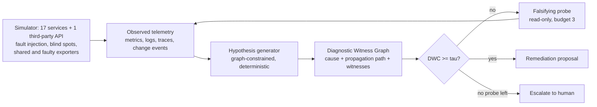

# FAULTWEAVER

**Evidence-bounded remediation for microservice root-cause analysis with telemetry blind spots.**

An RCA agent that names the right root cause most of the time will still act on the wrong one
the rest of the time, and it cannot tell those cases apart. Real systems make this worse: some
services have no traces, some metrics are missing, and several "independent" signals often come
through one collector. FAULTWEAVER puts a gate between the diagnosis and the remediation. An
action is allowed only when its **Diagnostic Witness Coverage (DWC)** is at least a threshold:
the claimed causal path, cause first, has to be backed by telemetry from independent sources.
Signals from one exporter count once. A step nobody can observe counts as zero. Otherwise the gate
runs read-only probes that could falsify the hypothesis, or it escalates to a human.

> v0.1 research prototype. Stdlib Python, no cloud account, no LLM. **All incidents are synthetic**,
> produced by a deterministic simulator in this repository; the numbers below are copied from
> [`reports/benchmark.md`](reports/benchmark.md) and regenerate with one command.



## Evidence

**Random sweep, 240 synthetic incidents** (60 each with 0/10/20/30% of services untraced, and metrics and
logs hidden at half that rate; red herrings, shared exporters and faulty exporters mixed in). *Correct
fix* means the right action on the right service. *Unsafe* means any other action. *Escalated* means
the incident went to a human.

| Method | Top-1 RCA | Correct fix | **Unsafe action** | Escalated |
|---|---|---|---|---|
| Graph-only anomaly ranking (personalised PageRank), act on top-1 | 31.2% | 31.2% | 68.8% (165) | 0.0% |
| Log-only reader (stand-in for LLM-only RCA; no LLM is run) | 75.8% | 75.0% | 25.0% (60) | 0.0% |
| Blind-spot-unaware graph agent, act on top-1 | 72.1% | 71.2% | 28.7% (69) | 0.0% |
| GALA-like graph-constrained agent without DWC, act on top-1 | 88.8% | 87.9% | 12.1% (29) | 0.0% |
| Same agent + gate on its own ranking confidence (escalation matched) | 88.8% | 86.2% | 9.2% (22) | 4.6% |
| DWC gate, escalate instead of probing (ablation) | 88.8% | 68.8% | 3.8% (9) | 27.5% |
| DWC without independence / blind-spot / ambiguity penalties (ablation) | 90.0% | 89.2% | 5.4% (13) | 5.4% |
| **FAULTWEAVER: DWC gate + falsifying probes** | **90.0%** | **90.0%** | **4.6% (11)** | 5.4% |

- The gate cuts unsafe actions from 29 to 11 without lowering the fix rate. Probes (0.442 per
  incident on average) cover the escalations the gate would otherwise need.
- If the agent's own confidence is used as the gate and tuned to the same 4.6% unsafe rate, it
  fixes 80.0% of incidents and escalates 15.4% (operating curve in the report). FAULTWEAVER fixes
  90.0% at that unsafe rate.
- **The penalties make a small difference on the random sweep:** 11 unsafe actions against 13 when
  they are removed. Over five seeds (7-11) the totals are 39 for FAULTWEAVER, 67 without penalties,
  81 for the confidence gate and 133 for the ungated agent. On the hand-built catalogue below, which
  concentrates blind spots, the penalties matter more: 2 unsafe actions against 5.

**Hand-labelled catalogue, 24 synthetic incidents** ([`scenarios/incidents.json`](scenarios/incidents.json)).
Each one targets a single situation: a dark root, a missing change audit, a cron-job red herring, a
third-party model API, a shared or broken collector.

| Method | Top-1 | Correct fix | Unsafe | Escalated |
|---|---|---|---|---|
| GALA-like agent, act on top-1 | 79.2% | 70.8% | 29.2% (7) | 0.0% |
| Confidence gate | 79.2% | 66.7% | 20.8% (5) | 12.5% |
| DWC without penalties (ablation) | 79.2% | 70.8% | 20.8% (5) | 8.3% |
| **FAULTWEAVER** | 79.2% | 75.0% | **8.3% (2)** | 16.7% |

**Negative results.** In the report, FAULTWEAVER acts unsafely in two constructed catalogue cases:

- `inc21`: the real cause, a third-party model API, is invisible and cannot be probed. At the same
  time a vector-store memory problem is real, has independent witnesses and partly propagates.
  DWC measures support, not truth, so the gate lets `scale_out vector-store` through (DWC 0.616).
- `inc22`: a broken collector's metrics, logs and spans are *labelled* as three independent
  sources. The gate approves `failover embedding` (DWC 0.6579). With honest labels (one shared
  source) the same incident is fixed correctly (DWC 0.8734). I found this case by searching for
  specs where changing only the provenance label changes the decision. The independence penalty
  is only as good as the provenance metadata.

In the sweep, 6 of the 11 unsafe actions are noisy-neighbour faults. The gate approves a failover
of the co-located *victim*. DWC's falsifier looks down the call graph for a deeper cause but not
sideways across a shared host. Five of the 11 involve a faulty exporter.

**True by construction.** The simulator and the scorer share one fault model (signatures, reliability
ordering, what each probe measures), and a probe returns ground truth. These numbers show that the
gate logic does what it was designed to do under controlled blind spots. They are not evidence of
real-world RCA accuracy. The fully hidden cases (`inc19` PCI zone, `inc20` dark third-party API)
escalate because nothing can witness the cause, which is the intended behaviour, not a finding. I
set the thresholds (tau = 0.6, penalties 0.5, reliabilities) by hand while inspecting the catalogue,
and changed no parameter after the first sweep run.

## Quickstart

```bash
python -m pip install "pytest>=8"
python -m pytest -q
python -m faultweaver bench --out reports     # catalogue + sweep + curve + 4 extra seeds, about 25 s
python -m faultweaver explain inc11           # the witness graph for one incident, as JSON
```

## How it works

- **Simulator** ([`faultweaver/sim.py`](faultweaver/sim.py)): 17 services, including an API gateway,
  auth, cart, checkout, payment, queue, worker, DB, cache, search, a RAG assistant, an LLM gateway,
  an embedding service and a vector store, plus one third-party model API. It injects six fault types:
  resource exhaustion, bad deploy, config error, dependency latency, network partition and noisy
  neighbour. Impact decays by 0.9 per hop up the call graph. Callers log upstream errors or
  `connection refused` and record error spans. The observation layer then applies blind spots
  (`metrics | logs | traces | events | all` per service), shared collectors (one independence group
  per node) and faulty collectors (add correlated, wrong latency, errors, error logs and error
  spans). Each incident's ground truth includes the one safe remediation.
- **Hypothesis generator** ([`faultweaver/rca.py`](faultweaver/rca.py) `rank`): a deterministic
  stand-in for an investigation agent. It scores each service by its own anomaly, what its callers
  say about it and, for services it cannot see into, anomaly inferred from its callers. It discounts
  services that are themselves explained by an anomalous dependency, and rewards services that
  explain the other anomalous ones. Fault type comes from the cosine to a signature over *observed*
  features only; unobserved features count as unknown, not as zero.
- **Diagnostic Witness Graph and DWC** (`dwc`). The path elements are the cause (weight 2) and each
  propagation hop (weight 1). An element's support is a noisy-OR over independence groups:
  `1 - prod_g (1 - max_{o in g} rel(o) * value(o))`. Only signals of at least 0.3 count, and `rel` is
  0.8 for traces, 0.7 for metrics, 0.6 for logs and 0.9 for change events and probes.
  `DWC = coverage x (1 - falsifier) x (1 - blind penalty) x (1 - ambiguity penalty)`, where
  - *falsifier* is the evidence that the cause is itself a victim of one of its dependencies;
  - the *blind penalty* (0.5) applies when the cause has a dependency nobody can see into;
  - the *ambiguity penalty* (0.5) applies when the defining signal of the chosen fault, or of a close
    rival fault, is unobservable, so the remediation type would be a guess.

  A probe that looks at an element and finds nothing sets DWC to 0.
- **Gate** (`investigate`): act if DWC >= 0.6. Otherwise run the cheapest falsifying probe for the
  weakest element. The order is unresolved dependencies, then undiscriminated fault types, then weak
  elements. The probes are `synthetic_check`, `resource_profile`, `change_history` and
  `dependency_check`. Re-rank and repeat up to 3 times, then escalate. Probes bypass exporters and
  respect per-incident probe bans.
- **Baselines** (build contract names → here): *graph-only anomaly ranking* → personalised PageRank
  over metric anomalies (MicroRCA-style). *LLM-only RCA* → a log-only reader: no graph, no metrics,
  **no LLM is run**. *GALA-like agent without DWC* → the same generator, acting on top-1.
  *Blind-spot-unaware RCA* → the generator scoring each service only by its own telemetry. Extra
  baseline: a gate on the generator's own ranking confidence.

## Prior art and what is not new

Based on the papers' abstracts, checked in September 2026:

- **GALA** (arXiv 2608.08968, ASE 2026) constrains LLM agents with the service graph, adds the STRIX
  trace- and graph-aware scorer and issues stratified action recommendations. The abstract does not
  describe an evidence threshold on actions. The "GALA-like" baseline here is a deterministic
  stand-in, not a reimplementation.
- **TORAI** (arXiv 2604.13522, FSE 2026) does multi-source RCA when the call graph has blind spots,
  and it covers diagnosis only. Blind-spot inference in this repository is much simpler.
- **Agentic NetOps/AIOps survey** (arXiv 2605.12729) recommends tying autonomy levels to required
  evidence and independent gates. This repository is one small, concrete instance of that
  recommendation.
- **Safe Remediation as Risk-Constrained Intervention Decision** (arXiv 2607.20005) is the closest
  work on gated remediation. It uses a CMDP that bounds the false-remediation rate, with blast
  radius, reversibility and epistemic uncertainty and a context-adaptive human-in-the-loop gate. It
  is broader on risk. Its abstract does not define path-level witness coverage or source independence.
- **GuardedAct** (arXiv 2609.11264) gates on rollback confidence and blast radius in a sandbox, so it
  looks at action risk rather than diagnostic evidence. **TelemetrySuffBench** (arXiv 2608.07899)
  shows that evidence gating and abstention reduce unsupported failure-origin answers from LLM agents.
  That is the same gating idea in another domain. **EviRCA** (arXiv 2609.19825) extracts deterministic
  evidence cards before the LLM reasons.
- Also relevant: RCAEval (benchmark with 735 real failure cases; not used here because v0.1 is
  synthetic), MicroRCA (the PageRank baseline), CausalRCA and RCD (causal discovery), Salesforce
  PyRCA, Microsoft RCACopilot, and open-source AI SRE agents (HolmesGPT, K8sGPT), where human review
  of a pull request is the gate.

The following are **not new**: gating autonomous actions on evidence or uncertainty, abstaining,
noisy-OR evidence combination, PageRank RCA and active probing. This repository adds an inspectable
gate score. It is defined over the *claimed propagation path*, and it explicitly discounts correlated
sources, unobservable steps and remediation-type ambiguity. The benchmark counts **unsafe remediations
and escalations**, not only RCA accuracy. No novelty is claimed beyond that engineering.

## Limitations

- **Synthetic only.** The build contract's minimum system (a Docker Compose microservice stack with
  OpenTelemetry and Prometheus) is replaced in v0.1 by a simulator that emits anomaly scores, not raw
  time series. No real telemetry pipeline was run.
- The simulator and the scorer share assumptions, and probes return ground truth with no cost or
  latency modelled, so "probe, then act" is optimistic. Time to diagnosis is not measured.
- One root cause per incident, plus optional red herrings. There are no multi-root cascades or
  retry storms.
- There is no sideways falsification across shared hosts, which causes most sweep failures.
- DWC is a gate score, not a probability. Before probes its Brier score is 0.1339, against 0.1009
  for DWC without penalties and 0.1249 for ranking confidence: the penalties make it deliberately
  conservative.
- Exporter provenance labels are trusted (`inc22`). The responder is assumed to know the fault model,
  meaning which services can suffer which faults.
- The "LLM-only" and "GALA-like" baselines are deterministic stand-ins, not the systems they are
  named after.

**Scope decisions.** The thesis requires CI, provenance in every report, a threat model
([`docs/THREAT_MODEL.md`](docs/THREAT_MODEL.md)) and a deterministic core. It does not yet require
OIDC, Terraform, Kubernetes, durable state or retries: nothing is executed, so there is no
mutation to make idempotent.

## Layout

```
scenarios/incidents.json   24 hand-labelled synthetic incidents (ground truth + safe remediation)
faultweaver/sim.py         topology, fault injection, propagation, blind spots, exporters, probes, sweep generator
faultweaver/rca.py         hypothesis generator, DWC + witness graph, gate, baselines
faultweaver/bench.py       benchmark, operating curve, calibration, seed robustness, reports
reports/                   generated evidence (JSON + Markdown)
```

## Next (v0.2)

Sideways (co-location) falsification, a real Compose + OpenTelemetry collector + Prometheus
testbed with fault injection, RCAEval replays, probe cost and risk, signed witness graphs checked by
the executor, and learned probe selection by expected information gain per unit of risk.

MIT licensed.
