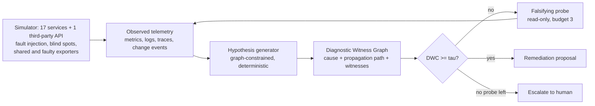

# FAULTWEAVER

**An RCA agent that names the right root cause most of the time still acts on the wrong one the rest of the time, and it cannot tell those cases apart, least of all when telemetry has blind spots.**

A remediation should be allowed only when its claimed causal path, cause first, is backed by telemetry from independent sources; otherwise the gate probes or escalates.



The gate score is **Diagnostic Witness Coverage (DWC)**. Signals from one exporter count once. A step
nobody can observe counts as zero.

> v0.1 research prototype. Stdlib Python, no cloud account, no LLM. **All incidents are synthetic**,
> produced by a deterministic simulator in this repository; the numbers below are copied from
> [`reports/benchmark.md`](reports/benchmark.md) and regenerate with one command.

## Worked example

`inc11-auth-config-no-audit`: a config error on `auth`, with the change audit for `auth` missing, so a
bad deploy and a config error look alike. The ungated GALA-like agent ranks `auth` first and acts on
its guess, `rollback auth`, which is unsafe (`reports/benchmark.json`, catalogue row `gala_like`).

```text
$ python -m faultweaver explain inc11
{
  "incident": "inc11-auth-config-no-audit",
  "symptom": "SLO alert at frontend",
  "hypothesis": {
    "cause": "auth",
    "fault": "config_error",
    "rivals": [],
    "propagation_path": [
      "auth",
      "api-gateway",
      "frontend"
    ],
    "proposed_remediation": [
      "revert_config",
      "auth"
    ]
  },
  "decision": "act",
  "probes_run": [
    [
      "change_history",
      "auth",
      null
    ]
  ],
  "witness_graph": {
    "dwc": 0.8791,
    "coverage": 0.8791,
    "falsifier": 0.0,
    "blind_penalty": 0.0,
    "unresolved_dependencies": [],
    "ambiguity_penalty": 0.0,
    "undiscriminated_faults": [],
    "contradicted_by_probe": false,
    "elements": [
      {
        "element": [
          "auth",
          "config_error"
        ],
        "kind": "cause",
        "weight": 2.0,
        "support": 0.973,
        "blind": false,
        "witnesses": [
          [
            "auth",
            "errors",
            null,
            0.795,
            "prom:n1"
          ],
          [
            "auth",
            "origin",
            null,
            0.721,
            "logs:n1"
          ],
          [
            "auth",
            "config",
            null,
            0.994,
            "probe:change_history"
          ]
        ]
      },
      ...
    ]
  },
  "ground_truth": {
    "remediation": [
      "revert_config",
      "auth"
    ]
  }
}
```

Before any probe the top hypothesis is `bad_deploy @ auth`, with `bad_deploy` and `config_error`
undiscriminated, so the 0.5 ambiguity penalty halves coverage 0.7666 to DWC 0.3833, below tau = 0.6
(`explain inc11 --tau 0` shows this graph; the `dwc_no_probes` ablation escalates here). The gate therefore runs one read-only `change_history` probe on `auth`.
The probe finds the config change (witness `probe:change_history`, 0.994), the fault type is resolved,
and DWC rises to 0.8791. The gate then allows `revert_config auth`, which matches the ground truth. The
elision hides the two propagation links, `auth -> api-gateway` (0.815) and `api-gateway -> frontend`
(0.755), each witnessed by a span and an upstream-error log.

## Results

**Random sweep, 240 synthetic incidents** (60 each with 0/10/20/30% of services untraced, and metrics and
logs hidden at half that rate; red herrings, shared exporters and faulty exporters mixed in). *Correct
fix* means the right action on the right service. *Unsafe* means any other action. *Escalated* means
the incident went to a human.

| Method | Top-1 RCA | Correct fix | **Unsafe action** | Escalated |
|---|---|---|---|---|
| Graph-only anomaly ranking (personalised PageRank), act on top-1 | 31.2% | 31.2% | 68.8% (165) | 0.0% |
| Log-only reader (stand-in for LLM-only RCA; no LLM is run) | 75.8% | 75.0% | 25.0% (60) | 0.0% |
| Blind-spot-unaware graph agent, act on top-1 | 72.1% | 71.2% | 28.7% (69) | 0.0% |
| GALA-like graph-constrained agent without DWC, act on top-1 | 88.8% | 87.9% | 12.1% (29) | 0.0% |
| Same agent + gate on its own ranking confidence (escalation matched) | 88.8% | 86.2% | 9.2% (22) | 4.6% |
| DWC gate, escalate instead of probing (ablation) | 88.8% | 68.8% | 3.8% (9) | 27.5% |
| DWC without independence / blind-spot / ambiguity penalties (ablation) | 90.0% | 89.2% | 5.4% (13) | 5.4% |
| **FAULTWEAVER: DWC gate + falsifying probes** | **90.0%** | **90.0%** | **4.6% (11)** | 5.4% |

- The gate cuts unsafe actions from 29 to 11 without lowering the fix rate. Probes (0.442 per
  incident on average) cover the escalations the gate would otherwise need.
- If the agent's own confidence is used as the gate and tuned to the same 4.6% unsafe rate, it
  fixes 80.0% of incidents and escalates 15.4% (operating curve in the report). FAULTWEAVER fixes
  90.0% at that unsafe rate.
- **The penalties make a small difference on the random sweep:** 11 unsafe actions against 13 when
  they are removed. Over five seeds (7-11) the totals are 39 for FAULTWEAVER, 67 without penalties,
  81 for the confidence gate and 133 for the ungated agent. On the hand-built catalogue below, which
  concentrates blind spots, the penalties matter more: 2 unsafe actions against 5.

**Hand-labelled catalogue, 24 synthetic incidents** ([`scenarios/incidents.json`](scenarios/incidents.json)).
Each one targets a single situation: a dark root, a missing change audit, a cron-job red herring, a
third-party model API, a shared or broken collector.

| Method | Top-1 | Correct fix | Unsafe | Escalated |
|---|---|---|---|---|
| GALA-like agent, act on top-1 | 79.2% | 70.8% | 29.2% (7) | 0.0% |
| Confidence gate | 79.2% | 66.7% | 20.8% (5) | 12.5% |
| DWC without penalties (ablation) | 79.2% | 70.8% | 20.8% (5) | 8.3% |
| **FAULTWEAVER** | 79.2% | 75.0% | **8.3% (2)** | 16.7% |

The report also has Top-3, per-blind-spot-level results, per-seed results, the full operating curve,
calibration and the per-incident table for all eight methods.

## Quickstart

```bash
python -m pip install "pytest>=8"
python -m pytest -q
python -m faultweaver bench --out reports     # catalogue + sweep + curve + 4 extra seeds, about 25 s
python -m faultweaver explain inc11           # the witness graph for one incident, as JSON
```

## Mechanism

- **Simulator** ([`faultweaver/sim.py`](faultweaver/sim.py)): 17 services, including an API gateway,
  auth, cart, checkout, payment, queue, worker, DB, cache, search, a RAG assistant, an LLM gateway,
  an embedding service and a vector store, plus one third-party model API. It injects six fault types:
  resource exhaustion, bad deploy, config error, dependency latency, network partition and noisy
  neighbour. Impact decays by 0.9 per hop up the call graph. Callers log upstream errors or
  `connection refused` and record error spans. The observation layer then applies blind spots
  (`metrics | logs | traces | events | all` per service), shared collectors (one independence group
  per node) and faulty collectors (add correlated, wrong latency, errors, error logs and error
  spans). Each incident's ground truth includes the one safe remediation.
- **Hypothesis generator** ([`faultweaver/rca.py`](faultweaver/rca.py) `rank`): a deterministic
  stand-in for an investigation agent. It scores each service by its own anomaly, what its callers
  say about it and, for services it cannot see into, anomaly inferred from its callers. It discounts
  services that are themselves explained by an anomalous dependency, and rewards services that
  explain the other anomalous ones. Fault type comes from the cosine to a signature over *observed*
  features only; unobserved features count as unknown, not as zero.
- **Diagnostic Witness Graph and DWC** (`dwc`). The path elements are the cause (weight 2) and each
  propagation hop (weight 1). An element's support is a noisy-OR over independence groups:
  `1 - prod_g (1 - max_{o in g} rel(o) * value(o))`. Only signals of at least 0.3 count, and `rel` is
  0.8 for traces, 0.7 for metrics, 0.6 for logs and 0.9 for change events and probes.
  `DWC = coverage x (1 - falsifier) x (1 - blind penalty) x (1 - ambiguity penalty)`, where
  - *falsifier* is the evidence that the cause is itself a victim of one of its dependencies;
  - the *blind penalty* (0.5) applies when the cause has a dependency nobody can see into;
  - the *ambiguity penalty* (0.5) applies when the defining signal of the chosen fault, or of a close
    rival fault, is unobservable, so the remediation type would be a guess.

  A probe that looks at an element and finds nothing sets DWC to 0.
- **Gate** (`investigate`): act if DWC >= 0.6. Otherwise run the cheapest falsifying probe for the
  weakest element. The order is unresolved dependencies, then undiscriminated fault types, then weak
  elements. The probes are `synthetic_check`, `resource_profile`, `change_history` and
  `dependency_check`. Re-rank and repeat up to 3 times, then escalate. Probes bypass exporters and
  respect per-incident probe bans.

## Threat and failure model

FAULTWEAVER sits between an untrusted investigator and whatever executes remediations, and never
executes anything itself. The investigator only proposes; DWC is computed from telemetry. Telemetry
values are partially trusted (missing, correlated or wrong). Exporter provenance labels are trusted
and are the weakest link. Assets, trust boundaries and the threat/control table are in
[`docs/THREAT_MODEL.md`](docs/THREAT_MODEL.md).

**Failure taxonomy.** What the simulator injects, and how FAULTWEAVER does on it in the reports:

| Class | In the simulator | Outcome |
|---|---|---|
| Fault types: resource exhaustion, bad deploy, config error, dependency latency, network partition | yes | mostly fixed; 2 resource-exhaustion and 1 each of bad-deploy, config-error and network-partition unsafe sweep actions |
| Fault type: noisy neighbour | yes | **not covered**: 6 of the 11 unsafe sweep actions. The gate approves a failover of the co-located *victim*. The falsifier looks down the call graph, not sideways across a shared host |
| Blind spot: missing metrics, logs, traces or change events on a service | yes | covered by the blind and ambiguity penalties plus probes (`inc07`, `inc08`, `inc11`, `inc18`, `inc23` fixed) |
| Blind spot: root fully dark but probeable | yes | covered by probes (`inc09`, `inc10` fixed); 4 unsafe sweep actions have a blind root |
| Blind spot: root dark and unprobeable (PCI zone, third-party API) | yes | escalates by design (`inc19`, `inc20`); nothing can witness the cause |
| Dark, unprobeable root plus a real, independently witnessed coincident fault | yes (`inc21`) | **not covered**: `scale_out vector-store` is allowed (DWC 0.616). DWC measures support, not truth |
| Shared exporter (correlated but true) | yes | covered by independence grouping (`inc15`, `inc24` fixed); 2 unsafe sweep actions involve one |
| Faulty exporter (correlated and wrong), labelled as one source | yes | covered by exporter-bypassing probes (`inc16` escalates); 5 unsafe sweep actions involve one |
| Faulty exporter with mislabelled provenance (three "independent" sources) | yes (`inc22`) | **not covered**: `failover embedding` is allowed (DWC 0.6579); with honest labels it is fixed (DWC 0.8734) |
| Red herrings (cron spike, sibling noise) | yes | mostly covered (`inc14` fixed, `inc12` escalates); 4 unsafe sweep actions involve one |
| Multi-root cascades, retry storms | no | not tested |
| Adversarial telemetry from two or more compromised sources | no | not controlled (see threat model) |

I found `inc22` by searching for specs where changing only the provenance label changes the decision.

## Experiment design

- **Incidents.** A hand-labelled catalogue of 24 incidents ([`scenarios/incidents.json`](scenarios/incidents.json)),
  each targeting one situation, including two constructed negative cases (`inc21`, `inc22`). A random
  sweep of 240 incidents, 60 at each of 0/10/20/30% of services untraced, with metrics and logs hidden
  at half that rate and red herrings, shared exporters and faulty exporters mixed in.
- **Ground truth.** Every incident records its root service, fault type and the one safe remediation.
  An action is *correct* only if both the action and the service match; any other action is *unsafe*.
- **Baselines.** Naive: a *log-only reader* standing in for LLM-only RCA (no graph, no metrics, **no LLM
  is run**), and a *blind-spot-unaware* graph agent scoring each service only by its own telemetry.
  Prior-art-inspired: *graph-only anomaly ranking*, personalised PageRank over metric anomalies
  (MicroRCA-style); a *GALA-like graph-constrained agent without DWC* (the same generator, acting on
  top-1); and the same agent with a *gate on its own ranking confidence*, whose threshold (0.52) is
  chosen so it escalates as often as FAULTWEAVER on the sweep. All are deterministic stand-ins.
- **Ablations.** DWC gate that escalates instead of probing; DWC without the independence, blind-spot
  and ambiguity penalties.
- **Seeds.** The sweep uses seed 7; seed robustness regenerates it with seeds 8-11 at the same
  thresholds. The operating curve moves each gate's threshold (0.4-0.8 for the DWC gates, 0.5-0.8 for
  the confidence gate).
- **Metrics.** Top-1/Top-3 service accuracy, correct fix, unsafe action (rate and count), escalation,
  unsafe-when-acting, probes per incident, and the Brier score and reliability bins of each gate score.
- **Regenerate.** `python -m faultweaver bench --out reports` writes `reports/benchmark.json` and
  `reports/benchmark.md` with provenance (commit, command, seed, Python version, scenario hash).
  `python -m faultweaver explain <incident>` prints the witness graph for one catalogue incident.

## What this result does not establish

- **Not real-world RCA accuracy.** The simulator and the scorer share one fault model (signatures,
  reliability ordering, what each probe measures). The numbers show that the gate logic does what it
  was designed to do under controlled blind spots, and nothing more.
- **Not the value of probing in practice.** A probe returns ground truth, with no cost, latency or load
  modelled, so "probe, then act" is optimistic. Time to diagnosis is not measured.
- **Not a comparison with the named systems.** The "LLM-only" and "GALA-like" baselines are
  deterministic stand-ins, not the systems they are named after, and no LLM is run anywhere.
- **Not a real telemetry stack.** The build contract's minimum system (a Docker Compose microservice
  stack with OpenTelemetry and Prometheus) is replaced in v0.1 by a simulator that emits anomaly
  scores, not raw time series. No real telemetry pipeline was run.
- **Not a finding about fully hidden causes.** `inc19` (PCI zone) and `inc20` (dark third-party API)
  escalate because nothing can witness the cause, which is the intended behaviour.
- **Not tuned-free.** I set the thresholds (tau = 0.6, penalties 0.5, reliabilities) by hand while
  inspecting the catalogue, and changed no parameter after the first sweep run.
- **Not a probability.** DWC is a gate score. Before probes its Brier score is 0.1339, against 0.1009
  for DWC without penalties and 0.1249 for ranking confidence: the penalties make it deliberately
  conservative.

## Limitations

- One root cause per incident, plus optional red herrings. There are no multi-root cascades or
  retry storms.
- There is no sideways falsification across shared hosts, which causes most sweep failures.
- Exporter provenance labels are trusted (`inc22`). The responder is assumed to know the fault model,
  meaning which services can suffer which faults.
- Nothing is executed: there is no remediation executor, and the executor accepting only gated actions
  is out of scope.

**Scope decisions.** The thesis requires CI, provenance in every report, a threat model
([`docs/THREAT_MODEL.md`](docs/THREAT_MODEL.md)) and a deterministic core. It does not yet require
OIDC, Terraform, Kubernetes, durable state or retries: nothing is executed, so there is no
mutation to make idempotent.

## Research lineage

Based on the papers' abstracts, checked in September 2026:

- **GALA** (arXiv 2608.08968, ASE 2026) constrains LLM agents with the service graph, adds the STRIX
  trace- and graph-aware scorer and issues stratified action recommendations. The abstract does not
  describe an evidence threshold on actions. The "GALA-like" baseline here is a deterministic
  stand-in, not a reimplementation.
- **TORAI** (arXiv 2604.13522, FSE 2026) does multi-source RCA when the call graph has blind spots,
  and it covers diagnosis only. Blind-spot inference in this repository is much simpler.
- **Agentic NetOps/AIOps survey** (arXiv 2605.12729) recommends tying autonomy levels to required
  evidence and independent gates. This repository is one small, concrete instance of that
  recommendation.
- **Safe Remediation as Risk-Constrained Intervention Decision** (arXiv 2607.20005) is the closest
  work on gated remediation. It uses a CMDP that bounds the false-remediation rate, with blast
  radius, reversibility and epistemic uncertainty and a context-adaptive human-in-the-loop gate. It
  is broader on risk. Its abstract does not define path-level witness coverage or source independence.
- **GuardedAct** (arXiv 2609.11264) gates on rollback confidence and blast radius in a sandbox, so it
  looks at action risk rather than diagnostic evidence. **TelemetrySuffBench** (arXiv 2608.07899)
  shows that evidence gating and abstention reduce unsupported failure-origin answers from LLM agents.
  That is the same gating idea in another domain. **EviRCA** (arXiv 2609.19825) extracts deterministic
  evidence cards before the LLM reasons.
- Also relevant: RCAEval (benchmark with 735 real failure cases; not used here because v0.1 is
  synthetic), MicroRCA (the PageRank baseline), CausalRCA and RCD (causal discovery), Salesforce
  PyRCA, Microsoft RCACopilot, and open-source AI SRE agents (HolmesGPT, K8sGPT), where human review
  of a pull request is the gate.

The following are **not new**: gating autonomous actions on evidence or uncertainty, abstaining,
noisy-OR evidence combination, PageRank RCA and active probing. This repository adds an inspectable
gate score. It is defined over the *claimed propagation path*, and it explicitly discounts correlated
sources, unobservable steps and remediation-type ambiguity. The benchmark counts **unsafe remediations
and escalations**, not only RCA accuracy. No novelty is claimed beyond that engineering.

## Roadmap

v0.2: sideways (co-location) falsification, a real Compose + OpenTelemetry collector + Prometheus
testbed with fault injection, RCAEval replays, probe cost and risk, signed witness graphs checked by
the executor, and learned probe selection by expected information gain per unit of risk.

## Layout

```
scenarios/incidents.json   24 hand-labelled synthetic incidents (ground truth + safe remediation)
faultweaver/sim.py         topology, fault injection, propagation, blind spots, exporters, probes, sweep generator
faultweaver/rca.py         hypothesis generator, DWC + witness graph, gate, baselines
faultweaver/bench.py       benchmark, operating curve, calibration, seed robustness, reports
reports/                   generated evidence (JSON + Markdown)
```

MIT licensed.
